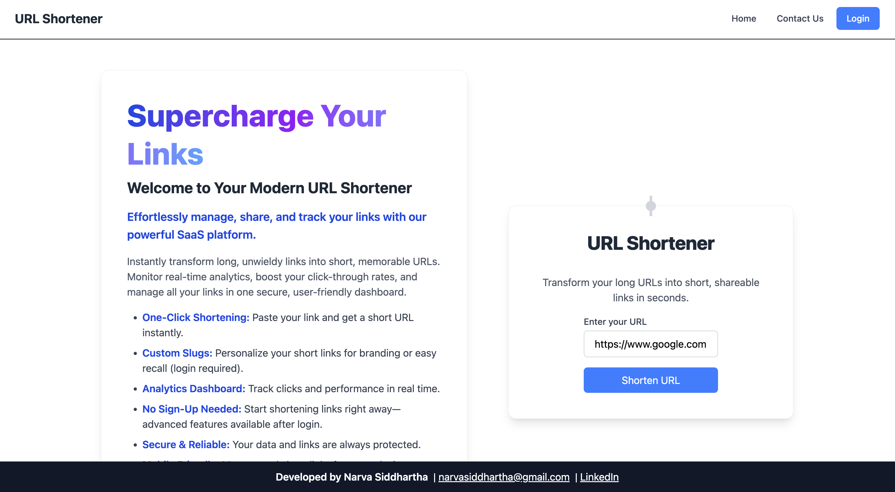
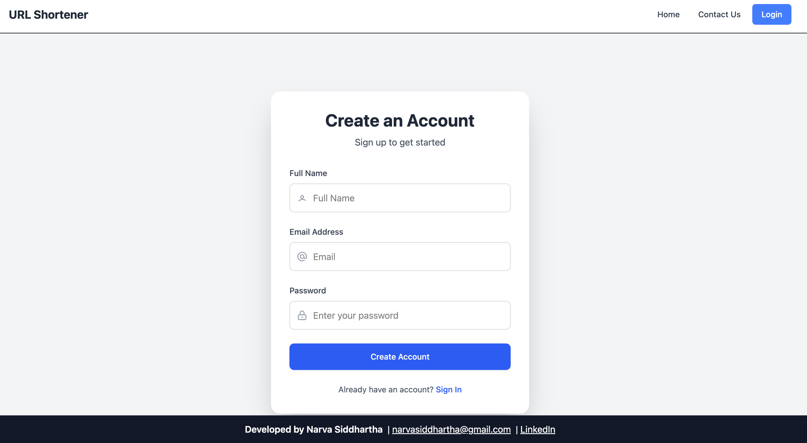
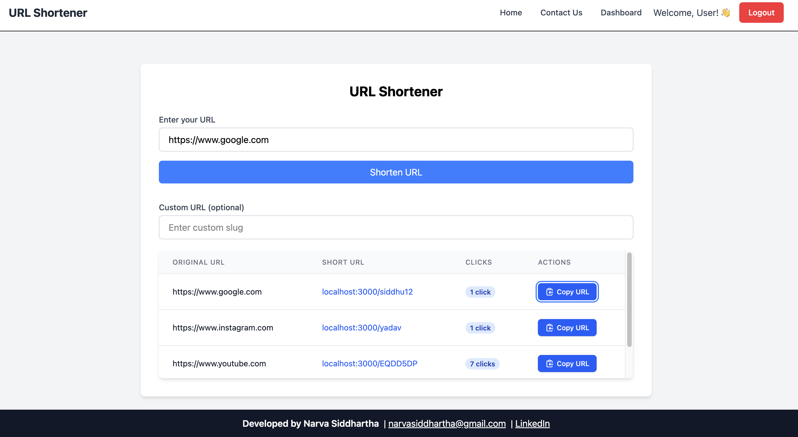

# URL Shortener





A full-stack URL shortening application built with React (Vite) and Node.js.

## Project Structure

```
URL_SHORTNER/
├── FRONTEND/         # React/Vite frontend application
└── BACKEND/          # Node.js backend server
```

## Prerequisites

- Node.js (v14 or higher)
- npm (Node Package Manager)

## Setup Instructions

### Backend Setup

1. Navigate to the backend directory:
   ```bash
   cd BACKEND
   ```
2. Install dependencies:
   ```bash
   npm install
   ```
3. Start the backend server:
   ```bash
   npm start
   ```
   The backend server will run on http://localhost:3000

### Frontend Setup

1. Navigate to the frontend directory:
   ```bash
   cd FRONTEND
   ```
2. Install dependencies:
   ```bash
   npm install
   ```
3. Start the development server:
   ```bash
   npm run dev
   ```
   The frontend application will run on http://localhost:5173

## Features

- URL shortening functionality
- Modern and responsive UI
- RESTful API endpoints
- Real-time URL validation
- Analytics dashboard for tracking clicks
- Custom slugs for branded short links
- No sign-up needed for basic shortening
- Secure and reliable

## Development

- Frontend is built with React and Vite for fast development and optimal performance
- Backend uses Node.js with Express for handling API requests
- The application follows RESTful API design principles

## License

This project is licensed under the MIT License.